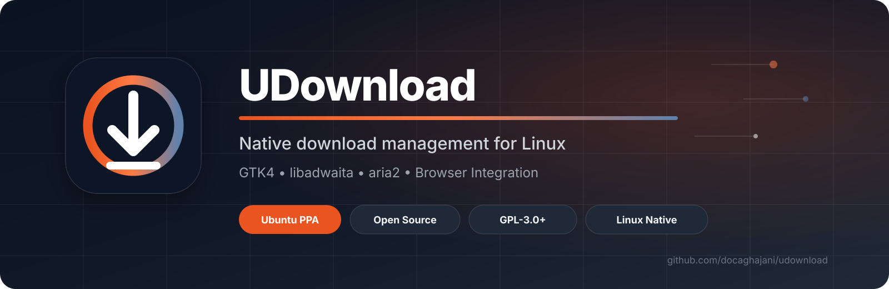

<p align="center">
  
</p>

<p align="center">
  <a href="https://github.com/docaghajani/udownload/releases/latest"></a>
  <a href="COPYING"></a>
  <a href="https://launchpad.net/~iaghajani/+archive/ubuntu/udownload"></a>
  
  
  
</p>

<p align="center">
  <strong>Fast transfers · Native Linux UX · Browser integration · Remote control · CLI</strong>
</p>

<p align="center">
  <a href="#-quick-start">Quick Start</a> •
  <a href="#-highlights">Highlights</a> •
  <a href="#-command-line">Command Line</a> •
  <a href="#-remote-downloads">Remote</a> •
  <a href="#-browser-integration">Browser Integration</a> •
  <a href="#-architecture">Architecture</a> •
  <a href="#-packaging-status">Packaging</a> •
  <a href="#-contributing">Contributing</a>
</p>

---

## Why UDM?

**UDM** is a native GTK4/libadwaita download manager for Linux powered by the
high-performance **aria2** transfer engine.

It is designed around a simple idea: advanced download management should feel like
a first-class Linux desktop experience — not a web page wrapped in a window.

<table>
<tr>
<td width="33%" valign="top">

### ⚡ Fast
Segmented and concurrent transfers powered by aria2.

</td>
<td width="33%" valign="top">

### 🧭 Native
GTK4 + libadwaita UI designed for the Linux desktop.

</td>
<td width="33%" valign="top">

### 🔗 Integrated
Chrome, Chromium and Firefox integration through Native Messaging.

</td>
</tr>
<tr>
<td width="33%" valign="top">

### ⏯ Reliable
Pause, resume and cancel behavior designed around live aria2 state.

</td>
<td width="33%" valign="top">

### 🕒 Organized
Queues, scheduling, categories, history and batch URL workflows.

</td>
<td width="33%" valign="top">

### 🌍 Remote
Send downloads to another UDM machine securely over SSH.

</td>
</tr>
</table>

---

## ✨ Highlights

<table>
<tr>
<td valign="top" width="50%">

### Transfer control

- Segmented downloads
- Multiple concurrent downloads
- Pause / Resume / Cancel
- Resume existing partial files
- Duplicate aria2 GID protection
- Live progress dialog
- Download-complete workflow

</td>
<td valign="top" width="50%">

### Power-user workflow

- Download queues
- Scheduling
- Batch URL handling
- Import / export links
- Download history
- Categories
- Persistent UI preferences

</td>
</tr>
<tr>
<td valign="top" width="50%">

### Desktop integration

- Native GTK4 UI
- libadwaita UX
- Open file
- Open with
- Open folder
- Drag completed files to other apps

</td>
<td valign="top" width="50%">

### Browser integration

- Google Chrome
- Chromium
- Mozilla Firefox
- Native Messaging bridge
- Browser-to-desktop download handoff
- Native-host repair support

</td>
</tr>
<tr>
<td valign="top" width="50%">

### Command line

- Add downloads without opening the GUI
- Start immediately with `--now`
- Schedule with `--at`
- Override destination with `--path`
- Resolve a usable filename before database insertion

</td>
<td valign="top" width="50%">

### Remote downloads

- SSH-based remote control
- Dedicated restricted Remote users
- Hidden terminal password entry
- SSH key support
- Windows OpenSSH and PuTTY/Plink support
- Default external port `8347`

</td>
</tr>
</table>

---

## 🚀 Quick Start

### Ubuntu — PPA

```bash
sudo add-apt-repository ppa:iaghajani/udownload
sudo apt update
sudo apt install udownload
```

Launch the application:

```bash
udownload
```

Run the built-in self-test:

```bash
udownload --self-test
```

Check the application version:

```bash
udownload --version
```

> Available Ubuntu series and current PPA builds are listed on
> [Launchpad](https://launchpad.net/~iaghajani/+archive/ubuntu/udownload).

### UDM 1.0.18 from GitHub

```bash
cd ~

git clone \
  --branch v1.0.18 \
  --depth 1 \
  https://github.com/docaghajani/udownload.git \
  udownload-1.0.18

cd ~/udownload-1.0.18

python3 -m py_compile \
  src/core.py \
  src/udownload.py \
  src/remote_admin.py \
  src/remote_command.py

python3 src/udownload.py --self-test
python3 src/udownload.py --version
```

To temporarily make this RC the `udownload` command while keeping the distro
package installed:

```bash
TESTDIR="$HOME/udownload-1.0.18"

printf '#!/bin/sh\nexec /usr/bin/python3 "%s/src/udownload.py" "$@"\n' "$TESTDIR" \
  | sudo tee /usr/local/bin/udownload >/dev/null

sudo chmod 755 /usr/local/bin/udownload
hash -r

command -v udownload
udownload --version
```

To return to the packaged build:

```bash
sudo rm -f /usr/local/bin/udownload
hash -r
```

---

## ⌨️ Command Line

UDM can add downloads directly from a terminal without opening the main window.

Add a URL to the queue:

```bash
udownload add "https://example.com/file.iso"
```

Start immediately:

```bash
udownload add "https://example.com/file.iso" --now
```

Choose a destination directory:

```bash
udownload add "https://example.com/file.iso" \
  --path "$HOME/Downloads/ISO" \
  --now
```

Schedule a download:

```bash
udownload add "https://example.com/file.iso" \
  --at "2026-08-13 22:30"
```

For CLI and Remote additions, UDM resolves a usable filename before inserting the
download into the database. If the server and URL do not expose a usable filename,
the command fails instead of creating a generic `download` entry.

---

## 🌍 Remote Downloads

UDM 1.0.18 adds SSH-based Remote control. A download can be sent to a UDM machine
from another computer while the actual transfer runs on the remote machine.

### 1. Configure the UDM machine

Open:

```text
UDM → Remote
```

Create a dedicated Remote username and password, for example:

```text
External port: 8347
Remote user: usrudm
Password: ********
```

UDM requests administrator authorization for the system setup.

The Remote account is restricted to UDM download commands. It is not intended to
provide a normal interactive shell. SSH forwarding, agent forwarding, X11, tunnels
and TTY access are disabled for the restricted Remote group.

The Remote password is handled by the normal Linux account mechanism and is not
stored in the UDM settings database.

### 2. Configure the router

The default **external** Remote port is `8347`. Forward it to the target computer's
normal SSH service:

```text
Internet TCP 8347
        ↓
Router / NAT
        ↓
UDM computer LAN IP : TCP 22
```

In router terminology:

```text
TCP 8347 → UDM computer LAN IP : 22
```

If a different external port is selected in UDM, forward that port to internal SSH
port `22`.

### 3. Send a download from another UDM installation

```bash
udownload remote "https://example.com/file.iso" \
  --server 23.53.215.63 \
  --user usrudm \
  --now
```

Port `8347` is the default, so `--port` is optional.

Override the port:

```bash
udownload remote "https://example.com/file.iso" \
  --server 23.53.215.63 \
  --port 9000 \
  --user usrudm \
  --now
```

When `--key` is not supplied, UDM launches the system OpenSSH client. OpenSSH asks
for the password directly in the terminal with echo disabled, so the password is not
shown while typing and is not placed in command history or process arguments.

Use an SSH private key instead:

```bash
udownload remote "https://example.com/file.iso" \
  --server 23.53.215.63 \
  --user usrudm \
  --key ~/.ssh/id_ed25519 \
  --now
```

### 4. Send a download without UDM installed on the client

Only an SSH client is required.

Linux / macOS / OpenSSH:

```bash
ssh -p 8347 usrudm@23.53.215.63 \
  'udownload add "https://example.com/file.iso" --now'
```

Windows Command Prompt / PowerShell with OpenSSH:

```cmd
ssh -p 8347 usrudm@23.53.215.63 "udownload add \"https://example.com/file.iso\" --now"
```

PuTTY / Plink:

```cmd
plink.exe -P 8347 -l usrudm 23.53.215.63 "udownload add \"https://example.com/file.iso\" --now"
```

The same Remote username/password works for both the UDM Remote command and direct
SSH clients.

Full setup and security details:

**[Read the Remote Guide →](docs/REMOTE.md)**

---

## 🌐 Browser Integration

UDM can receive download requests directly from supported browsers through
a Native Messaging bridge.

| Browser | Integration |
|---|---|
| Google Chrome | ✅ Supported |
| Chromium | ✅ Supported |
| Mozilla Firefox | ✅ Supported |

Native Messaging host:

```text
com.ideveloper.udownload.native
```

Full setup guide:

**[Read the Browser Integration Guide →](docs/BROWSER_INTEGRATION.md)**

---

## 🧠 Architecture

```text
┌──────────────────────────────────────────────────────────┐
│          Chrome · Chromium · Firefox · Local CLI         │
└──────────────────────────┬───────────────────────────────┘
                           │ Native Messaging / CLI
                           ▼
┌──────────────────────────────────────────────────────────┐
│                           UDM                            │
│                 GTK4 + libadwaita desktop UI             │
│                                                          │
│ Queue · Scheduler · History · Categories · Remote · CLI  │
└──────────────────────────┬───────────────────────────────┘
                           │ aria2 RPC
                           ▼
┌──────────────────────────────────────────────────────────┐
│                          aria2                           │
│              High-performance transfer engine            │
└──────────────────────────┬───────────────────────────────┘
                           │
                           ▼
                        Downloads

Remote client
     │
     │ SSH / external TCP 8347
     ▼
Router / NAT
     │ forwards to TCP 22
     ▼
Restricted UDM Remote account
     │
     └──────────────► UDM add command
```

The UI and transfer engine are intentionally separated. aria2 handles network
transfers while UDM manages desktop UX, state synchronization, scheduling,
browser communication, Remote authentication and file actions.

---

## 🔐 Transfer Reliability

UDM adds transfer-state handling around aria2 to make desktop controls
predictable during real-world use.

- Pause and Cancel operate against the live transfer state.
- Partial data remains resumable.
- Resume continues the existing file instead of creating unnecessary duplicates.
- Duplicate aria2 GIDs targeting the same destination are detected and stopped.
- Transfer RPC work stays away from the GTK main thread so the UI remains responsive.
- Active download rows continue updating while their context menu is open.

---

## 📦 Packaging Status

| Target | Status |
|---|---|
| GitHub release | 🟢 `v1.0.18` |
| Ubuntu PPA | 🟢 Available |
| Ubuntu 24.04 LTS (Noble) | 🟢 PPA build available |
| Ubuntu development series | 🟢 PPA build available |
| Ubuntu Universe | 🟠 Sponsorship requested |
| Debian | 🟠 Debian Mentors package available |

### Ubuntu

- **PPA:** [ppa:iaghajani/udownload](https://launchpad.net/~iaghajani/+archive/ubuntu/udownload)
- **Packaging request:** [Launchpad Bug #2163282](https://bugs.launchpad.net/ubuntu/+bug/2163282)

### Debian

- **Debian Mentors:** [mentors.debian.net/package/udownload](https://mentors.debian.net/package/udownload/)

---

## 🧪 Release & Packaging Checks

```text
✓ Python compilation checks
✓ Built-in UDM self-test
✓ Remote command self-test
✓ Remote administration self-test
✓ desktop-file validation
✓ AppStream metadata validation
✓ Debian Lintian
✓ Clean Debian unstable sbuild
✓ Ubuntu Launchpad build farm
✓ APT installation from the public Launchpad PPA
```

---

## 🛠 Technology

<table>
<tr>
<td><strong>Desktop UI</strong></td><td>GTK4</td>
<td><strong>Linux UX</strong></td><td>libadwaita</td>
</tr>
<tr>
<td><strong>Transfer engine</strong></td><td>aria2</td>
<td><strong>Application</strong></td><td>Python 3</td>
</tr>
<tr>
<td><strong>Browser bridge</strong></td><td>Native Messaging</td>
<td><strong>Remote transport</strong></td><td>OpenSSH</td>
</tr>
<tr>
<td><strong>Packaging</strong></td><td>Debian / Ubuntu</td>
<td><strong>License</strong></td><td>GPL-3.0-or-later</td>
</tr>
<tr>
<td><strong>App ID</strong></td><td><code>com.ideveloper.UDownload</code></td>
<td><strong>Remote port</strong></td><td><code>8347</code> external → <code>22</code> internal</td>
</tr>
</table>

---

## 📁 Repository Layout

```text
udownload/
├── bin/        Application launchers
├── browser/    Chrome / Chromium / Firefox integration
├── data/       Desktop files, icon and AppStream metadata
├── docs/       Browser and Remote documentation
├── src/        Application, CLI and Remote helpers
└── systemd/    Service integration
```

---

## 🤝 Contributing

Bug reports, feature requests, documentation improvements and code contributions
are welcome.

**[Open an Issue →](https://github.com/docaghajani/udownload/issues)**

```bash
git clone https://github.com/docaghajani/udownload.git
cd udownload
git checkout -b feature/my-improvement
```

Keep changes focused and submit them through a Pull Request.

---

## 📄 License

UDM is free and open-source software licensed under the
**GNU General Public License v3.0 or later**.

See [COPYING](COPYING) for the complete license text.

---

## 👨‍💻 Author

**AmirHossein Aghajani**  
GitHub: [@docaghajani](https://github.com/docaghajani)  
Email: `aghajani@dr.com`

---

<p align="center">
  <strong>UDM — Download better on Linux.</strong>
</p>

<p align="center">
  <a href="https://github.com/docaghajani/udownload/releases/latest">Latest Release</a> •
  <a href="https://github.com/docaghajani/udownload/issues">Report a Bug</a> •
  <a href="https://launchpad.net/~iaghajani/+archive/ubuntu/udownload">Ubuntu PPA</a>
</p>

<p align="center">
  ⭐ If UDM is useful to you, consider starring the repository.
</p>
